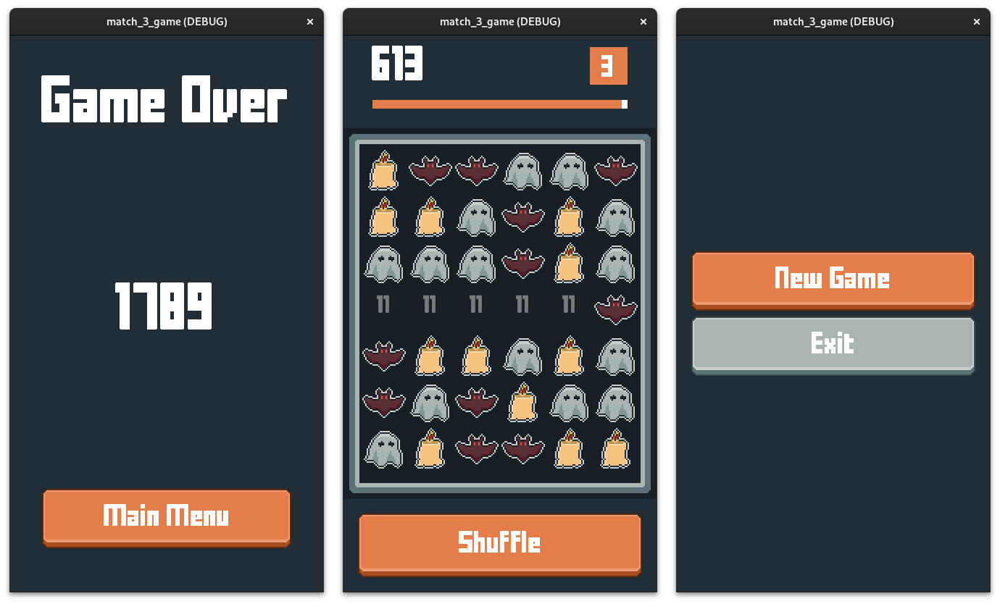

# Match3 Game
This is a simple, yet fully functional "match 3" game created using Godot 4.

The core components (`match_3_core.gd` and `grid.gd`) are documented for developers interested in implementing their own match 3 game. While the documentation is not complete, it should provide sufficient guidance.

## How to Play?
- Drag adjacent pieces to make matches.
- If you get stuck, use the shuffle button.
- If the counter reaches zero and the level-up bar also reaches zero, you lose.

## How to use?
Cloning the repository and importing the project into Godot 4.1.2 should suffice. Be sure to read the `match_3_core.gd` file for additional information.

## Assets
I own all the assets used. Feel free to use them. I do not own the fonts.

- **fff-forward**: [license](assets/fonts/fffforwad_license.txt)
- **terminal-grotesque**: [license](assets/fonts/terminal-grotesque_license.txt)
